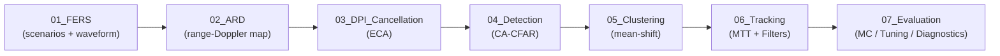

# Tracking Filters for a Passive Radar System

## Author
**Itumeleng Malemela**
Master's Dissertation Repository

---

## Overview

This repository contains the MATLAB implementation of tracking filters designed
for an **FM Passive Radar System**, together with the full processing chain
(FERS simulation, ECA clutter cancellation, CA-CFAR, mean-shift clustering,
multi-target tracking, and Monte Carlo evaluation).

It also hosts the source of the CIE 2026 conference paper *"Design and
Implementation of Tracking Filters for a Passive Radar System"*.

---

## Pipeline



---

## Implemented tracking filters

1. **Kalman Filter (KF)**
2. **Unscented Kalman Filter (UKF)**
3. **Particle Filter (PF)**
4. **Recursive Gauss-Newton Filter (RGNF)**
5. **Adaptive Covariance Scaling** (Akhlaghi 2018), applied to all four
   filters with a particle-cloud analogue in the PF

---

## How to run

`startup.m` at the repo root auto-adds every subfolder to the MATLAB path.
Invoke any script by name from the repo root:

```bash
matlab -batch "mc_evaluate_filters(100)"     # Table I MC (100 seeds)
matlab -batch "mtt_mc(100)"                  # Table IV MTT MC
matlab -batch "tune_kf_ukf_orbit"            # KF/UKF orbit tuning sweep
matlab -batch "run_filter_live"              # Live single-filter plot
```

If MATLAB is opened interactively in the project root, `startup.m` runs
automatically and no extra `addpath` is needed.

---

## Companion paper

The CIE 2026 conference paper lives in `Paper/`. Its Table I, Table IV, and
computational-load tables are produced by scripts in `07_Evaluation/MC/` and
`07_Evaluation/Tuning/`.

Build:
```bash
cd Paper
pdflatex -shell-escape IEEE_ConferencePaperCIE.tex
bibtex IEEE_ConferencePaperCIE
pdflatex -shell-escape IEEE_ConferencePaperCIE.tex
pdflatex -shell-escape IEEE_ConferencePaperCIE.tex
```

---

## License

MIT — see [LICENSE](LICENSE).

---

## Table of contents

```
FM-PR-TrackingFilters/
├── 01_FERS/                      FERS scenarios, HDF5 loaders, FM waveform inputs
├── 02_ARD/                       Amplitude Range Doppler cross-correlation
├── 03_DPI_Cancellation/          ECA direct-path interference cancellation
├── 04_Detection/                 CA-CFAR detector
├── 05_Clustering/                Mean-shift clustering of CFAR detections
├── 06_Tracking/
│   ├── Filters/
│   │   ├── KF/                   Kalman filter + CSKF (covariance-scaling variant)
│   │   ├── UKF/                  Unscented Kalman filter + CSUKF
│   │   ├── PF/                   Particle filter + CSPF
│   │   ├── RGNF/                 Recursive Gauss-Newton filter + CSRGNF
│   │   └── IMM/                  Interacting Multiple Model (future work)
│   └── MTT/                      Gating, GNN association, M-of-N track management
├── 07_Evaluation/
│   ├── MC/                       Monte Carlo evaluation drivers
│   ├── Tuning/                   Filter parameter sweeps and optimisation
│   ├── GroundTruth/              Cubic-waypoint ground truth generation
│   ├── Diagnostics/              Per-seed traces, sanity checks
│   └── Legacy/                   Superseded evaluation and tuning scripts
├── Runners/                      Top-level entry-point scripts
├── Cache/                        Cluster / measurement caches
├── Paper/                        CIE 2026 conference paper source
├── Docs/                         Archived paper snippets, notes
├── Simulation_results/           Static images from prior campaigns
├── figures/                      Root-level figures (superseded by Paper/figures)
├── seeds/                        (gitignored) per-seed FERS thermal-noise realisations
├── UCT Msc Docs/                 Dissertation-related documents
├── startup.m                     Adds all subfolders to MATLAB path
├── gated_association.m           Mahalanobis gate + GNN utility
├── LICENSE                       MIT
└── README.md
```
